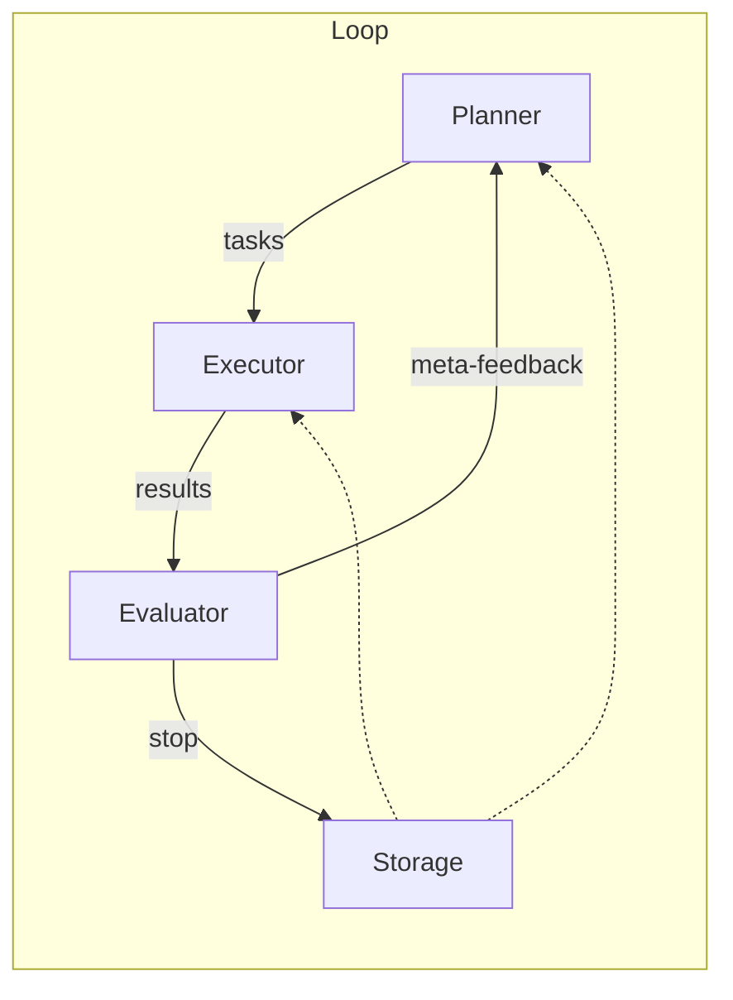

0. Design Goal 

장기 목표 — LLM이 스스로 목표‑계획‑실행‑반성 루프를 돌며 끊임없이 사고(Thought)를 확장·최적화하는 자율 에이전트를 TypeScript/LangChain/LangGraph로 구현.

⸻

1. Top‑Level Loop (“Plan → Execute → Reflect”)

단계	LangGraph 노드	주요 역할	LangChain 컴포넌트
Plan	PlannerNode	장기 목표를 세분화한 Todo 리스트 생성	PlanAndExecuteAgent  
Execute	ExecutorNode	각 Todo를 툴(검색, 코드, API 등)과 Thought Generation / Update Chain으로 수행	AgentExecutor, LLMChain
Reflect	EvaluatorNode	결과 평가·메타‑피드백 → 새로운 목표·수정점 도출	LLMChain + custom metrics
Continue / Finish	ControllerEdge	평가 점수·완료 조건에 따라 루프 반복 or 종료	LangGraph conditional edge

LangGraph의 저수준 제어 + 시각화를 활용해 노드·엣지·조건을 선언적으로 정의   .

⸻

2. 세부 모듈 (고도화 버전)
1.	Thought Generation Chain


	2.	Thought Update Chain
	•	입력: {oldThought, feedback}
	•	출력: {updatedThought, diff} + 버전 히스토리 push.
	3.	Memory Layer
	•	Graph DB (Neo4j) → 부모‑자식, 연관 엣지.
	•	Vector Store (Pinecone/Weaviate) → 임베딩 검색.
	•	KV/Cache (Redis) → 단기 state & locks.
	4.	Scheduler / Event Loop
	•	BullMQ queue + cron(“*/5 min”) → 자율 Tick.
	•	외부 Webhook / user input / file watcher로도 Trigger.
	5.	Safety & Governance
	•	토큰/시간 쿼터, content‑filter, max‑depth, max‑iterations.
	•	LangGraph human‑in‑the‑loop edge 지원  .

⸻

3. LangGraph 선언 예시

```typescript
import { Graph } from "@langchain/langgraph";

const g = new Graph()
  .addNode("plan", plannerNode)
  .addNode("execute", executorNode)
  .addNode("reflect", evaluatorNode)
  .addEdge("plan", "execute")
  .addEdge("execute", "reflect")
  .addConditionalEdge("reflect", {
  continue: "plan",
  finish: "END"
});
export const autonomousAgent = g.compile({ start: "plan" });
```


⸻

4. 데이터 흐름 & 상태 관리


	•	Storage: Thought Node Store + Vector + Graph.
	•	각 노드는 metadata(score, tags, createdAt) 포함 → 중요도 계산·정렬.

⸻

5. 개발 로드맵 (Sprint 단위)
1.	MVP Loop (Planner‑Executor‑Reflect, 인메모리 저장)
2.	Persistent Memory (Neo4j + Pinecone)
3.	Scheduler & Queue (자동 Tick)
4.	Human‑in‑the‑Loop / Guardrails
5.	Observability (metrics, traces, LangSmith)

⸻

6. 키 포인트 정리
•	LangChain → 체인·툴·에이전트 구현.
•	LangGraph → 루프/분기/재시도 등 컨트롤 플로우를 선언적으로.
•	Plan → Execute → Reflect 구조로 자율성 확보.
•	그래프 DB + 벡터 DB로 장단기 기억 결합.
•	Queue + Scheduler로 지속적 사고.
•	안전장치·관찰성으로 신뢰성 확보.

이 구조를 기반으로 모듈을 구현하면, AI가 스스로 목표를 세우고 무한히 사고를 확장하는 시스템을 단계적으로 완성할 수 있습니다.
